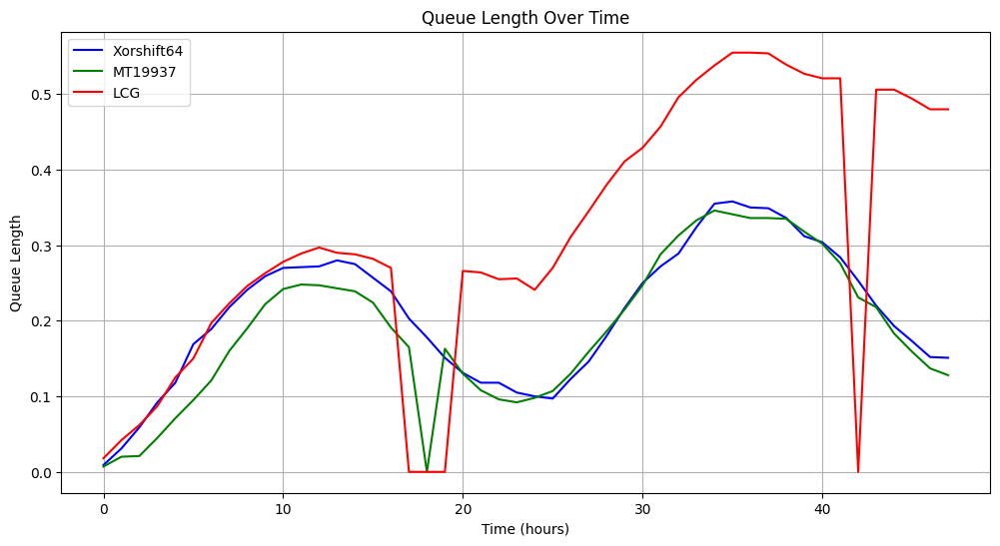

# Trabajo Especial (C) - Modelos y Simulación 2025

## 1. Presentación

**Fecha:** 15/06/2025

**Integrantes:**
- Ludueña Zakka, Juan Pablo (juan.luduena.161@mi.unc.edu.ar)
- Toledo, Alejando Matías (amtoledo2002@mi.unc.edu.ar)


## 2. Resumen

Este proyecto tiene como objetivo analizar distintos métodos de generación de números pseudoaleatorios uniformes y aplicarlos a la simulación de un sistema de colas de un solo servidor. Se seleccionaron los siguientes generadores:  
- Generador Congruencial Lineal (LCG)
- XORShift
- Mersenne Twister (MT19937)  

Se simula un sistema con arribos siguiendo un proceso de Poisson no homogéneo y tiempos de atención exponenciales, durante un período de 48 horas.

## 3. Descripción Teórica de los Generadores

### 3.1 Generador Congruencial Lineal (LCG)

- Fórmula:  
```math
  X_{n+1} = (aX_n + c) \mod m
```
- Parámetros utilizados:  
```math
  a = 16807, \ c = 0, \  m = 2^{31} - 1
```
### 3.2 XORShift

- Algoritmo basado en operaciones XOR y desplazamientos bit a bit.
- Fórmula:  
```math
\begin{aligned}
&\quad X_n = X_{n-1} \oplus (X_{n-1} \ll 13)  \\
&\quad X_n = X_n \oplus (X_n \gg 7)  \\
&\quad X_n = X_n \oplus (X_n \ll 17)  \\
&\text{donde } X_n \in \{0, \ldots, 2^{64} - 1\}, \quad X_0 \neq 0
\end{aligned}
```

- Eficiente y liviano, con buena distribución para ciertas configuraciones.

### 3.3 Mersenne Twister (MT19937)


- Basado en un generador de periodo muy largo: $2^{19937} - 1$
- Fórmula:
```math
\begin{aligned}
&\text{Para cada } k = 0, 1, \ldots, N - 1: \\
&\quad y = (x_k \ \& \ \text{UPPER\_MASK}) + (x_{k+1} \ \& \ \text{LOWER\_MASK}) \\
&\quad x_k = x_{k+M} \oplus \left( \frac{y}{2} \right) \oplus \text{mag01}[y \bmod 2] \\[1em]

&\text{Tempering (suavizado final):} \\
&\quad y = x_k \\
&\quad y = y \oplus (y \gg u) \\
&\quad y = y \oplus ((y \ll s) \ \& \ b) \\
&\quad y = y \oplus ((y \ll t) \ \& \ c) \\
&\quad y = y \oplus (y \gg l) \\[1em]

&\text{Resultado final:} \quad \frac{y}{2^{32}} \in [0, 1)
\end{aligned}
```
- Alta calidad estadística, usado por defecto en muchas librerías.

## 4. Descripción del Problema

Se desea simular un sistema de colas de un solo servidor durante 48 horas.  

- **Arribos:**  
  Proceso de Poisson no homogéneo con intensidad  
```math
   \lambda(t) = 30 + 30 \cdot \sin\left( \frac{2\pi t}{24} \right)[clientes/hora]
```

- **Servicio:**  
  Distribución exponencial con tasa $\mu = 40$ [clientes/hora]

- **Justificación:**  
  Se implementa un solo servidor. En este, usamos una cola FIFO que sigue la dinámica de clientes que esperan, entran en servicio cuando el servidor se libera, y permiten calcular métricas como tiempo promedio en el sistema, uso del servidor, etc.

## 5. Metodología

### 5.1 Implementación del Proceso de Arribos

Se utilizó el método de *thinning* para generar tiempos de arribo no homogéneos.  
La cota superior de la función $λ(t)$ es $λ_{max} = 60$.

### 5.2 Generación de Tiempos de Servicio

Se usó la técnica de la transformada inversa para generar valores exponenciales:  
```math
T = -\frac{1}{\mu} \cdot \ln(1 - U) \ \text{donde} \ U \sim \mathcal{U}(0,1)
```

### 5.3 Servidor

Toma dos parámetros: 
- `t_arrivals`: Corresponde a la lista de los eventos generados.
- `gen`: Se pasa la instancia del generador elegido.

Atiende a cada uno de los eventos si el servidor está disponible. En caso de que llegue un evento y el servidor esté ocupado, éste se agrega a la cola y va a ser atendido una vez el servidor esté liberado y sea su turno en la cola.

### 5.4 Simulación

Se simula el sistema durante 48 horas, generando eventos de arribo y servicio. Se registran métricas como:
- Tiempo promedio en el sistema por cliente.
- Porcentaje de tiempo que el servidor está ocupado.
- Longitud de la cola a lo largo del tiempo.
- Tiempo de espera promedio en la cola.

## 6. Resultados

Nos parecio importante comparar el uso del servidor con la longitud de la cola para analizar y comprender el comportamiento del sistema de colas con cada generador de números aleatorios.

### 6.1 Longitud de la Cola a lo Largo del Tiempo


Podemos observar que el generador Xorshift presenta una longitud de cola más estable y baja en comparación con los otros generadores, lo que indica un mejor rendimiento en la simulación del sistema de colas.
Aunque por momentos el generador LCG y MT19937 muestran que la cola se vacia, el LCG se mantiene con una longitud de cola mas alta en toda la simulación. 

### 6.2 Tiempo de uso del servidor

Podemos notar que ambos 3 generadores la mayoria del tiempo se mantienen con un tiempo cercano de de uso del servidor, vemos que LCG y MT19937 tienen un comportamiento similar, cuando su cola esta vacia el servidor no se utiliza pues no hay arribo de clientes en ese momento, tiene un uso constante del servidor.

## 7. Conclusiones

En conclusion a este breve analisis, podemos afirmar que el generador Xorshift es el que mejor se adapta a la simulación del sistema de colas, ya que presenta una longitud de cola más estable y baja en comparación con los otros generadores.
El generador LCG, aunque es simple y rápido de implementar, muestra una mayor longitud de cola y un uso del servidor menos eficiente. Por otro lado, el Mersenne Twister (MT19937) ofrece un rendimiento similar al LCG, pero con una mayor complejidad computacional y no es tan estable como el XorShift.
Asi que si bien algunos generadores son mas faciles de implementar, no siempre son los mejores para simular un sistema de colas, y es importante evaluar el rendimiento de cada generador en función del problema a resolver.


## 8. Código fuente

El código fuente puede ser encontrado [aquí](/Ludueña_Toledo_Trabajo_Especial_2025.ipynb).